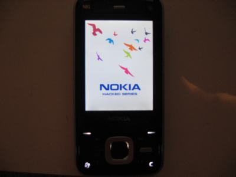

# Reverse Engineering on Nokia N81 – Splashscreen

I reversed engineered my Nokia N81 because I wanted to copy the Nokia N95's splashscreen mod, which it was said not to be compatible with some phones. N81 included.

Posted on May 19, 2012 on juricalleri.net

---

Before I begin I assume you already know how `Domainsrv version 6` works, you already know how to change at least the bootanimation and of course I assume you know C2Z and the different ways to hack your phone, rompatcher included.

1. I copied `splashscreen.exe` from Z: to E: then copied again to Windows.

2. I was unable to open this file with a common Hex-Editor so I searched on the net some programs to open such kind of file, E32 image file. I found Petran.

3. Using Petran I could open this file so I thought to redirect the output to an empty-notepad file, what is written below is part of the output:
```
003a005a 00500053 0041004c 00480053 00430053 00450052 004e0045 004d002e 
```
...and "translated" is:
```
:.Z.P.S.A.L.H.S.C.S.E.R.N.E...M.
```

4. Few words to say that the Path is there but...
    let's take the 1st part, the 1st four values:
    ```
    003a005a 00500053
    ```
    what is there written?
    ```
    .3a.5a.50.53
    ```
    which means   `: Z P S`
    
    it's easy to understand that the whole hex-value means: `Z:splashscreen.mif` but it is written with every 2 letters swapped of location.

5. It was not possible to edit this .exe file so I thought to write a rompatcher's patch that once enabled at phone boot, could have changed the path from Z: to C:

    the patch was so written:
```
;splashscreen patch n81 by nihvel
SnRs\bin\splashscreen.exe:003a005a005000530041004c004 800530043005300450052004e0045004d002e:003a00430050 00530041004c004800530043005300450052004e0045004d002e
```

This patch is made to search the string where `splashscreen.exe` use `Z:\splashscreen.mif` and modify with `C:\`.
It didn't work, maybe due to the fact N81 has the splashscreen.exe located in the part of the ROM not editable.

6. I asked to a friend of mine to pass me his original N95 splashscreen.exe and I could open it with a common Hex-Editor, without using Petran then.
I used the N95 rompatcher's patch to exactly know what it does and I found out that splashscreen.exe of N95 is different than the N81 one, like before, the fact that it can be opened with a common Hex-Editor means that it is not "write protected" so I thought that N95 one is located in the part of the Symbian rom where user can write on it.

This is why the patch works and also why reading the patch itself or N95' `splashscreen.exe` letters are not swapped.
```
    ;splash changer
    ;patch per cambiare lo splashscreen iniziale (la scritta Blu Nokia)
    ;made by leetut and corrected by dannydj
    SnRs\bin\SplashScreen.exe:5A003A00530050004C004100530 04800530043005200450045004E002E004D0049004600:4300 3A00530050004C00410053004800530043005200450045004E 002E004D0049004600
    5a003A00:43003A00
```

Here it is written Z: : C: without being swapped.

7. Since Petran was the only one who opened the N81 one, I tried to do a petran /help and also looking on the web to know more about this tool.

Petran has the "nocompress" option, trying to do then: `petran –nocompress splashscreen.exe` I was able to open my N81 splashscreen with any Hex-Editor and I’ve also seen with surprise that letters were no more swapped.

The N81 splashscreen was like N95 one.

8. The last step then was to edit using an Hex-Editor, the path were it loaded the .mif file, changing Z: with C:
Once saved, I put the modified `splashscreen.exe` under `C:\sys\bin` and when I rebooted I’ve seen the "blue Nokia logo" changed with a new one, the one I’ve choosen.


